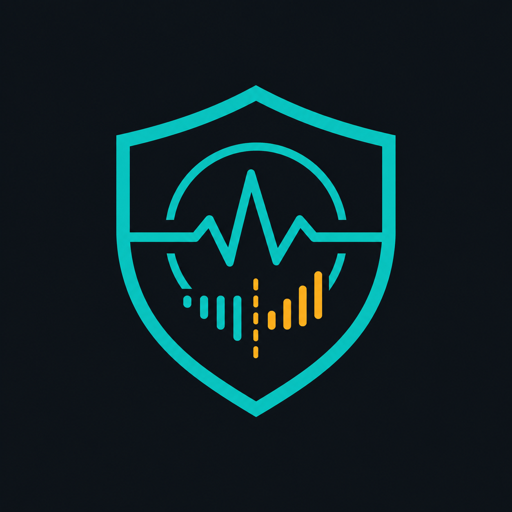

 

**Secure Watch**

Java 프로젝트의 의존성 보안 변화를 기준선과 비교해 추적·보고하는 오픈소스 도구

 

An open-source tool for tracking and reporting security changes in Java project dependencies against a baseline.

Maintained by <a href="https://github.com/hadevyi">@hadevyi</a>

.